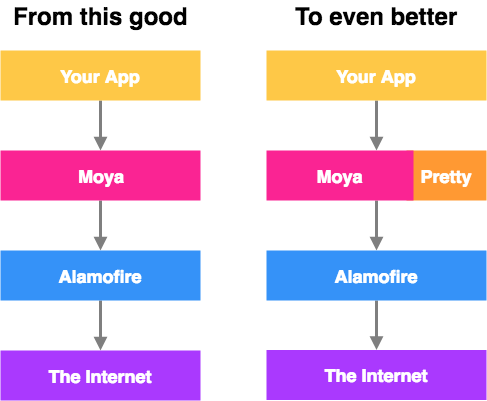

# Moya-Pretty

[](https://travis-ci.org/arthurgau0419@gmail.com/Moya-Pretty)
[](https://cocoapods.org/pods/Moya-Pretty)
[](https://cocoapods.org/pods/Moya-Pretty)
[](https://cocoapods.org/pods/Moya-Pretty)

*Moya-Pretty* provides many powerful extensions like *generic class-based target*, *plugins*, even *RESTful traits*. This allows you to declare Moya Target more pretty and without writing those extensions again by yourself. 
Inspired by [*Moya*](https://github.com/Moya/Moya) and [*Retfofit*](https://github.com/square/retrofit). 👍 👍 👍



## Generic<> Target
### Codable
*decode, encode Json*
CodableTarget<Body, Response>
EncodableTarget<Body>
DecodableTarget<Response>
### ObjectMapper
*json, xml mapping*
MappableTarget<Body, Response>
MappableBodyTarget<Body>
MappableResponseTarget<Response>

## Usage
Simply, declare your target class:
```swift
struct PetService {  
  class PostPetThenResponsePet: CodableTarget<Pet, Pet>, BaseTargetType {
    var method = Method.post
    var path = "pet/"    
  }
  class PostPetOnly: EncodableTarget<Pet>, BaseTargetType {
    var method = Method.post
    var path = "pet/"    
  }
  class GetPets: DecodableTarget<[Pet]>, BaseTargetType {
    var method = Method.get
    var path = "pet/"    
  }
}
```

Then, execute it:
```swift
let provider = MoyaProvider<PetService.AddPet>() 
let pet = Pet(id: 1, name: "Obi")
let target = PetService.AddPet(body: pet)
provider.requestModel(target, completion: { (result) in
  switch result {
    case .success(let pet):
      // Pet model here 🎉 🎉 🎉
      print(pet.name)
    case .failure(let error):
      fail(error.localizedDescription)
  }
)
  
```

## Example

`pod try Moya-Pretty`

To run the example project, clone the repo, and run `pod install` from the Example directory first.

## Requirements

## Installation

Moya-Pretty is available through [CocoaPods](https://cocoapods.org). To install
it, simply add the following line to your Podfile:

```ruby
pod 'Moya-Pretty'

pod 'Moya-Pretty/RxSwift'

pod 'Moya-Pretty/PromiseKit'

pod 'Moya-Pretty/RESTful'

pod 'Moya-Pretty/Plugins'

pod 'Moya-Pretty/ObjectMapper'
```

## Author

arthurgau0419@gmail.com, arthurgau0419@gmail.com

## License

Moya-Pretty is available under the MIT license. See the LICENSE file for more info.
